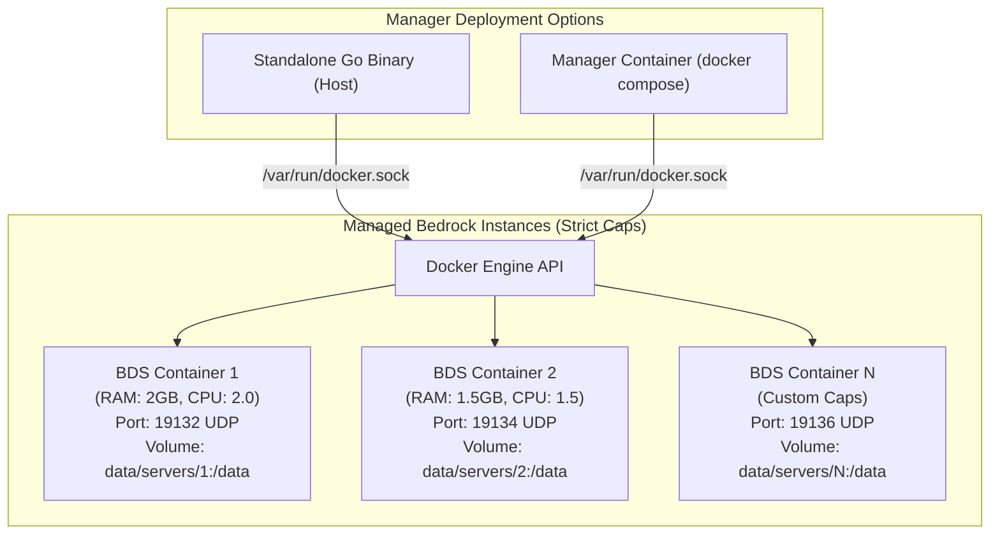

# Bedrock Server Manager - Architecture & Technical Specification

## 1. Executive Summary

Bedrock Server Manager is a lightweight, self-hosted management platform for Minecraft Bedrock Dedicated Servers (BDS). To enforce strict per-server CPU and RAM resource caps, all Minecraft Bedrock servers are orchestrated as isolated Docker containers via the Docker Engine API.

The **Manager itself** supports two deployment models:
1. **Standalone Binary**: Run directly on the host as a single compiled Go binary (connecting to local `/var/run/docker.sock`).
2. **Docker Compose**: Run inside a lightweight container via `docker-compose.yml` (mounting `/var/run/docker.sock`).

---

## 2. Core Decisions & Tech Stack

| Domain | Technology / Design Choice | Rationale |
| :--- | :--- | :--- |
| **Backend Language** | **Go (Golang 1.22+)** | Zero-dependency static compilation, low RAM/CPU footprint, strong concurrency model for Docker SDK and WebSocket handling. |
| **Frontend Framework & UI** | **React 18 + Vite + Tailwind CSS + Lucide Icons** | Fast, responsive SPA embedded via `embed.FS`. Styled exclusively in a **Dark Mode Only** sleek obsidian/cyberpunk aesthetic with Minecraft emerald accents, optimized for desktop and mobile devices. |
| **Server Runtime Engine** | **Docker Engine API via Go SDK (`itzg/minecraft-bedrock-server`)** | Bedrock server natively lacks CPU/RAM limits. Orchestrating instances as Docker containers guarantees strict memory/CPU caps, port bindings, and safe isolation. |
| **Data Persistence** | **Dual Embedded SQLite (`modernc.org/sqlite`)** | Clean architectural separation: Primary DB (`data/manager.db`) for relational metadata & configuration; Dedicated Telemetry DB (`data/metrics.db`) in WAL mode for time-series metrics with automated 24h rolling retention. |
| **Authentication & Scope** | **JWT with Argon2id + Internal-Only API** | RBAC supporting `Admin` (full system access) and `Server Operator` with **Per-Server Access Control** (restricted to assigned instances only). No external API/remote keys; API is strictly internal to the Web UI. |
| **Real-time Comms** | **WebSockets (`gorilla/websocket` or `coder/websocket`)** | Low-latency bi-directional communication for interactive BDS console streams, real-time player events, and system metrics. |
| **Terminal Emulator** | **xterm.js + fit-addon** | Browser-based interactive console with 1,000-line ring buffer, ANSI coloring, and command history. |

---

## 3. Containerized Server Architecture

The platform orchestrates all Minecraft Bedrock instances via the Docker Engine API (`/var/run/docker.sock`):



### 3.1. Docker Orchestrator (`DockerEngine`)
- Connects to `/var/run/docker.sock` (or `DOCKER_HOST`) using the official Docker Go SDK.
- Spawns and manages sibling containers using the battle-tested `itzg/minecraft-bedrock-server` base image.
- Enforces hardware resource caps:
  - Memory: `--memory` and `--memory-swap`
  - CPU: `--cpus` (NanoCPUs)
- Volume binding: maps host directory `data/servers/{id}` to container `/data`.
- Bidirectional console attachment (`ContainerAttach`) for real-time interactive stdin/stdout over WebSockets.
- Real-time container stats (`ContainerStats`) streaming CPU %, RAM usage, and network I/O.

---

## 4. Bedrock Server Management & Lifecycle

### 4.1. Server Creation, Updates, Cloning & Migration
- **Guided Creation with Presets**: One-click configuration presets ('Vanilla Survival', 'Creative Building', 'Hardcore') pre-populating recommended game rules, difficulty, view distance, and tick-distance, alongside advanced custom mode.
- **Image Hub & Version Tags**: Automatically pulls and configures `itzg/minecraft-bedrock-server` with configurable version tags (`VERSION=LATEST`, `VERSION=PREVIEW`, or specific BDS version string like `1.21.20.03`).
- **Update Banner with 1-Click Upgrade**: Periodically checks for new upstream BDS releases, displaying an upgrade notification banner in the web UI. 1-click upgrade automatically triggers a safety hot-backup of the server prior to pulling the new image and recreating the container.
- **1-Click Server Cloning**: Duplicates an existing server instance (configs, world, behavior/resource packs) into a new server with an automatically allocated, non-conflicting port.
- **Full Server Export**: Downloads the entire server instance as a single portable `.zip` bundle (including configs, packs, and world) for straightforward migration, disaster recovery, or sharing between hosts.
- **Auto-Start on Boot**: Per-server configurable toggle (`autostart_on_boot: boolean`). When the manager daemon initializes (e.g. host restart or container start), designated server instances automatically launch without manual intervention.

### 4.2. Configuration Management (GUI-Managed & Configuration-Only)
- **Strictly GUI-Managed Settings**: All server and container settings are managed via validated form inputs (no arbitrary environment variable injection or unvalidated text blobs), ensuring security and preventing container launch failures.
- Visual form editors and structured JSON/properties editors restricted to designated server files:
  - `server.properties` (Gamemode, difficulty, max players, allow-cheats, level-seed, tick-distance, etc.).
  - `allowlist.json` (`[{"name": "...", "xuid": "...", "ignoresPlayerLimit": false}]`).
  - `permissions.json` (`[{"permission": "operator"|"member"|"visitor", "xuid": "..."}]`).
- Arbitrary file browsing is disabled by design to eliminate path traversal vulnerabilities and prevent accidental file deletion.

### 4.3. Player Hub & Live Chat Broadcaster
- **Live Connection Tracking**: Parses stdout logs (`Player connected: <name>, xuid: <xuid>` / `Player disconnected`) and maintains active session list.
- **Gamertag & XUID Synchronization**: Automatically resolves and stores player XUIDs for allowlist and operator permissions.
- **Quick Player Actions**: Kick, ban, teleport, change permission level (`operator`, `member`, `visitor`), and broadcast in-game messages.
- **Dedicated In-Game Chat Feed**: Real-time stream parsing in-game player chat messages into a clean, dedicated web chat panel (isolated from system logs).
- **Direct Message & Global Broadcaster**: Web UI form to send global announcements (styled `say` / `tellraw` broadcasts) or direct private messages (`tell <player> <msg>`) without touching the raw terminal console.

### 4.4. Zero-Downtime Hot Backups, World Management & Retention
- **Hot Backup Protocol**:
  1. Sends `save hold` to server stdin.
  2. Polls `save query` until BDS reports files are ready for copying.
  3. Copies snapshot files and world data to a compressed zip archive in `data/backups/{server_id}/`.
  4. Issues `save resume` to resume disk writes without stopping gameplay.
- **World Management**: Import and export `.mcworld` or `.zip` archives, reset world, seed customization.
- **Comprehensive Retention & Disk Quotas**:
  - **Count Retention**: Retains the last N backups (default: 10, configurable per server).
  - **Age Retention**: Automatically purges unpinned backups older than X days (default: 14 days).
  - **Disk Quota Limit**: Sets an optional maximum disk quota per server (e.g. 10 GB); oldest unpinned backups are purged when quota is reached.
  - **Pin / Lock Protection**: Allows administrators to lock/bookmark milestone backups to protect them from automated retention cleanup.
- **Automated Scheduling**: Cron-based triggers for recurring backups and scheduled restarts.

### 4.5. Addons & Packs (Vanilla BDS Focus)
- Dedicated support for official Vanilla Bedrock Dedicated Server (BDS).
- Upload and install `.mcpack` and `.mcaddon` archives into `behavior_packs` and `resource_packs`.
- Automatic extraction and registration in `world_behavior_packs.json` and `world_resource_packs.json`.

### 4.6. Shutdown & Restart Workflows (Admin Choice)
- The administrator can trigger:
  1. **Graceful Stop**: Broadcasts a countdown warning (`say Server shutting down in X...`), disconnects active players with a clean maintenance reason (`Server Maintenance/Restarting`), issues `stop` to BDS console to flush LevelDB chunks, and waits up to 20 seconds before container termination.
  2. **Direct BDS Stop**: Immediately issues `stop` command to server stdin and waits for clean process exit without broadcast countdowns.
  3. **Emergency Force Kill**: Forcefully stops container immediately if BDS hangs or deadlocks.

### 4.7. Comprehensive Parameter Taxonomy (Configurable Settings)

All server configuration is organized into structured, validated UI tabs:

| Category | Parameter | Target Mapping | Type / Valid Values | Default |
| :--- | :--- | :--- | :--- | :--- |
| **Resources** | Memory Limit (RAM) | Docker `--memory` | Number (MB/GB) | `2048 MB` |
| | Memory Swap Limit | Docker `--memory-swap` | Number (MB/GB, `0` = disabled) | `0 MB` |
| | CPU Core Quota | Docker `--cpus` | Number (0.5 to host cores) | `2.0` |
| | Worker Threads | `MAX_THREADS` | Integer (`0` = auto, 1–16) | `0` |
| **Networking** | Server IPv4 Port | `server-port` / Docker port | UDP Port (1024–65535) | `19132` |
| | Server IPv6 Port | `server-portv6` / Docker port | UDP Port (1024–65535) | `19133` |
| | Online Mode (Xbox Auth) | `online-mode` | Boolean (`true` / `false`) | `true` |
| **Identity** | Server Display Name | `server-name` (MOTD) | String (max 64 chars) | `Bedrock Server` |
| | Version Tag | Container Image tag | `LATEST`, `PREVIEW`, or version string | `LATEST` |
| **Gameplay** | Game Mode | `gamemode` | `survival`, `creative`, `adventure` | `survival` |
| | Difficulty | `difficulty` | `peaceful`, `easy`, `normal`, `hard` | `normal` |
| | World Seed | `level-seed` | String / Numeric seed | `""` (Random) |
| | Allow Cheats | `allow-cheats` | Boolean (`true` / `false`) | `false` |
| | Default Permission | `default-player-permission-level` | `visitor`, `member`, `operator` | `member` |
| | Force Texture Pack | `texturepack-required` | Boolean (`true` / `false`) | `false` |
| **Simulation** | Max Players | `max-players` | Integer (1–100) | `10` |
| | View Distance | `view-distance` | Integer (8–32 chunks) | `16` |
| | Tick Distance | `tick-distance` | Integer (4–12 chunks) | `4` |
| | Player Idle Timeout | `player-idle-timeout` | Integer minutes (`0` = disabled) | `30` |
| **Security** | Allowlist Enforced | `white-list` / `allow-list` | Boolean (`true` / `false`) | `false` |
| | Allowlist Ignores Limit | `allow-list-ignores-player-limit` | Boolean (`true` / `false`) | `false` |
| **Movement** | Server Authoritative Movement | `server-authoritative-movement` | `client-auth`, `server-auth`, `server-auth-with-rewind` | `server-auth` |
| | Movement Threshold | `player-movement-score-threshold` | Integer | `20` |
| **Lifecycle** | Auto-Start on Boot | Database `autostart_on_boot` | Boolean (`true` / `false`) | `false` |
| | Crash Circuit Breaker | Database restart policy | 5 crashes / 5 min circuit breaker | Enabled |

---

## 5. Reliability, Telemetry & Automation

### 5.1. Crash Loop Detection & Resource Management
- **Circuit Breaker**: Auto-restart on unexpected exit with exponential backoff; halts auto-restart if 5 crashes occur within a 5-minute window.
- **Resource Constraints**: Configurable per-server RAM and CPU limits (enforced via Docker container flags in Docker mode, or process monitoring alerts on bare-metal).

### 5.2. Telemetry, Downsampling & Tiered Rollups
- **Dedicated Metrics DB (`data/metrics.db`)**: High-write frequency time-series database isolated from relational metadata.
- **WAL Mode (`PRAGMA journal_mode=WAL`)**: Non-blocking concurrent reads and writes; chart queries never block metric ingestion.
- **Configurable Collection Interval (Admin Setting)**:
  - Default: **Every 2 seconds** (`collection_interval_seconds = 2`).
  - Configurable via Admin Settings (e.g. 1s, 2s, 5s, 10s).
- **In-Memory Buffer & Batched Disk Flush**: Ingests high-frequency samples in an in-memory queue and flushes in bulk transactions (every 30s) to minimize disk I/O and prevent flash/SSD wear.
- **Tiered Rollup & Downsampling Architecture**:
  - **Raw Samples (High Resolution, e.g. 2s)**: Stored in `metrics_raw` for real-time live gauges and short-term 1-hour window. Pruned after 2–6 hours.
  - **5-Minute Rollups (`metrics_5m`)**: Downsampled every 5 minutes (`AVG`, `MAX`, `MIN` for CPU %, RAM bytes, and player count). Retained for 7 days.
  - **1-Hour Rollups (`metrics_1h`)**: Downsampled every hour from 5-minute data. Retained for 30–90 days for long-term capacity planning.
- **Fast Dashboard Queries**: Charts automatically query the appropriate tier (e.g. "1h" view queries raw, "24h" view queries 5m rollups [only ~288 points], "30d" view queries 1h rollups), rendering in <1ms without lag.

### 5.3. Task Scheduler & Broadcast Automations
- Unified cron-based scheduler supporting:
  - Daily/weekly scheduled restarts with automated in-game warning countdown broadcasts (e.g. at 5m, 1m, 10s: `say Server restarting in X...`).
  - Recurring zero-downtime hot backups.
  - Timed console command executions.

### 5.4. Networking & RakNet Ping
- **Port Allocation**: Automatic suggestion and assignment of unused UDP ports starting at `19132` (IPv4) and `19133` (IPv6), with collision checks against host interfaces and existing servers.
- **RakNet UDP Ping Poller**: Periodically sends Bedrock Unconnected Ping packets to verify server responsiveness, retrieve real-time MOTD, latency, player count, and version.

---

## 6. Notifications, Webhooks & Onboarding

### 6.1. Discord Webhooks & Notification Center
- Per-server and global Discord webhook notifications for:
  - Server crash alerts (with crash log snippet).
  - Server start / stop status.
  - Player join / leave events.
  - Hot backup completion / failure.
- In-app notification center / toast alerts for real-time dashboard feedback.

### 6.2. First-Launch Setup Wizard
- Automatically detects fresh installation (empty database).
- Directs initial browser request to an onboarding wizard at `/setup`:
  - Create primary Admin username & password (hashed with Argon2id).
  - Set manager title / branding.
  - Configure optional global Discord webhook.
  - Generates secure cryptographic JWT signing secret.
- Supports optional environment variable overrides (`ADMIN_USER`, `ADMIN_PASSWORD`, `JWT_SECRET`) for headless/automated infrastructure deployments.

### 6.3. Full Web Audit Log Viewer
- Dedicated in-app audit dashboard tracking all administrative and operator actions:
  - Server lifecycle events (start, graceful stop, direct stop, force kill, restart).
  - Player moderation (kicks, bans, permission level changes, op/deop).
  - Server configuration alterations (`server.properties`, `allowlist.json`, `permissions.json`).
  - Hot backups (manual triggers, restores, pin/lock changes, deletions).
  - Authentication events (successful logins, failed attempts, password changes).
- Includes multi-filter search (by user, action category, server ID, date range) and CSV/JSON export capability.

### 6.4. Frontend Embedding & Single-Binary Distribution
- **`//go:embed` Standard Library Integration**:
  - The React SPA is built via Vite (`npm run build`) into static assets in `web/dist`.
  - The compiled Go binary embeds `web/dist` directly into the executable using Go's `embed.FS`.
  - **Zero external web servers**: In production, the single Go executable serves all HTML, JS, CSS, fonts, and images directly from memory with gzip compression.
  - **SPA History Fallback**: Non-API routes are automatically routed to `index.html` so client-side React Router navigation works seamlessly across all paths (`/servers/*`, `/settings`, `/setup`, etc.).
  - **Development Mode**: In development, `vite` runs with Hot Module Replacement (HMR) and proxies `/api` and `/ws` requests to the Go backend on `localhost:8080`.

### 6.5. Manager Web Server, Reverse Proxy & Session Security
- **Web Server & Binding**:
  - Listens on `0.0.0.0:8080` by default.
  - Configurable via environment variables: `PORT=8080` and `DATA_DIR=data`.
  - Reverse proxy ready: works seamlessly behind standard reverse proxies (Nginx, Caddy, Traefik, Cloudflare Tunnel) for external SSL/TLS termination with `X-Forwarded-For` and `X-Forwarded-Proto` support.
- **Session Security & Sliding Expiration**:
  - Standard 24-hour JWT session token stored in secure, HttpOnly, SameSite cookies.
  - Automatic sliding refresh on active dashboard interactions.
  - Optional 30-day "Remember Me" extended token for trusted administrator devices.

### 6.6. Web Navigation Architecture & Layout Hierarchy
- **Dual-Tier Layout**:
  - **Tier 1 (Global Sidebar)**:
    - 🖥️ **Servers**: Card grid/list of instances with live CPU/RAM/player gauges and "+ New Server" button.
    - 📜 **Audit Logs**: Platform-wide activity audit trail.
    - 👥 **Users**: User accounts, Admin vs Operator roles, and per-server access grants (Admin only).
    - ⚙️ **Settings**: Global telemetry sampling rate (2s default), Discord webhooks, and system update banner.
  - **Tier 2 (Server Context Hub)**:
    - Persistent top status header: Server Title, State Badge (Running, Stopped, Crashed, Updating), Port, and Power Action Controls (Start, Graceful Stop, Direct Stop, Force Kill, Restart, Clone, Export).
    - Dedicated Context Tabs:
      - 📟 **Console**: Real-time xterm.js terminal over WebSockets with 1,000-line ring buffer.
      - 👥 **Players & Chat**: Active players list, Allowlist, Ops, and dedicated live In-Game Chat Feed & Broadcaster.
      - 📈 **Telemetry**: CPU %, RAM, and player count charts (1h raw, 24h/7d 5m rollups, 30d 1h rollups).
      - ⚙️ **Configuration**: Form editors for `server.properties`, `allowlist.json`, and `permissions.json`.
      - 💾 **Backups & Worlds**: Zero-downtime hot backups, retention settings, pin/lock toggle, world import/export.
      - 🧩 **Addons & Packs**: Behavior & Resource pack drag-and-drop installer.
      - ⏰ **Scheduled Tasks**: Cron-based auto-restarts with warnings, scheduled backups, and commands.
- **Mobile & Tablet Responsive Adaptation**:
  - Collapses global navigation into a slide-over left drawer with top hamburger toggle button.
  - Server context tabs scroll smoothly horizontally with sticky top status banner for thumb-friendly mobile control.
- **Client Route Structure**:
  - `/setup` (Setup Wizard)
  - `/login` (Authentication)
  - `/servers` (Server List Overview)
  - `/servers/new` (Guided Server Creation Modal)
  - `/servers/:id/console` (Console View)
  - `/servers/:id/players` (Player Hub & Chat)
  - `/servers/:id/telemetry` (Performance Charts)
  - `/servers/:id/config` (Server Configuration)
  - `/servers/:id/backups` (Backups & Worlds)
  - `/servers/:id/addons` (Addon Manager)
  - `/servers/:id/tasks` (Task Scheduler)
  - `/audit` (Audit Log Viewer)
  - `/users` (User Management)
  - `/settings` (System Settings)

---

## 7. Directory Layout

```text
Bedrock-Server-Manager/
├── cmd/
│   └── manager/
│       └── main.go               # Application entrypoint
├── internal/
│   ├── api/                      # REST & WebSocket HTTP routes and middleware
│   │   ├── auth.go
│   │   ├── servers.go
│   │   ├── players.go
│   │   ├── backups.go
│   │   ├── console_ws.go
│   │   ├── webhooks.go
│   │   └── router.go
│   ├── config/                   # Global configuration loading (env, file)
│   ├── database/                 # SQLite setup and migrations
│   │   ├── db.go
│   │   └── models.go
│   ├── driver/                   # Server execution drivers
│   │   ├── driver.go             # ServerDriver interface
│   │   ├── process_driver.go     # Bare-metal child process supervisor
│   │   └── docker_driver.go      # Docker SDK container driver
│   ├── raknet/                   # Bedrock UDP ping client
│   ├── backup/                   # Hot backup and world export engine
│   ├── webhook/                  # Discord webhook dispatcher
│   └── downloader/               # Mojang BDS zip downloader and updater
├── web/                          # Embedded Frontend (React + Vite + Tailwind)
│   ├── src/
│   │   ├── components/
│   │   ├── pages/
│   │   └── services/
│   ├── index.html
│   ├── package.json
│   └── vite.config.ts
├── Plan/                         # Project plan and specifications
│   ├── ARCHITECTURE_SPEC.md
│   └── IMPLEMENTATION_PLAN.md
├── Dockerfile                    # Multi-stage Docker build
├── docker-compose.yml            # Out-of-the-box compose setup
├── go.mod
└── go.sum
```

