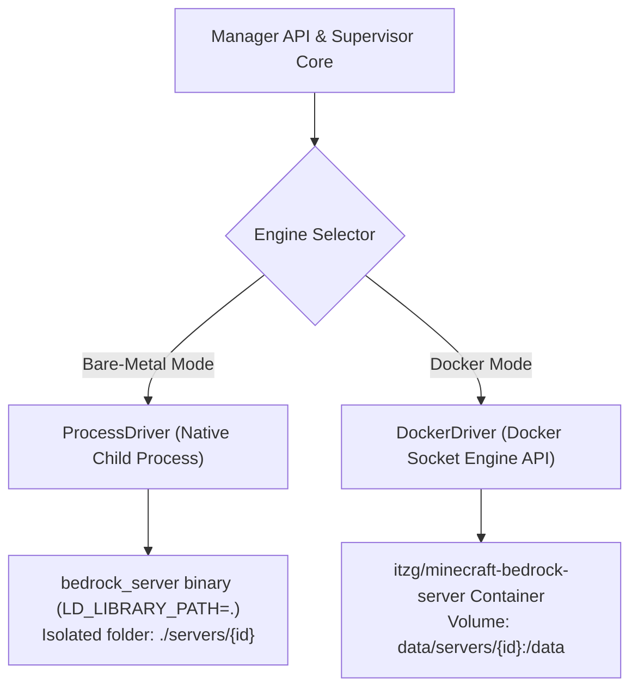

# Bedrock Server Manager - Architecture & Technical Specification

## 1. Executive Summary

Bedrock Server Manager is a lightweight, self-hosted management platform for Minecraft Bedrock Dedicated Servers (BDS). It is designed to run seamlessly either on **bare-metal Linux hosts** (as a single compiled Go binary) or inside **Docker environments** (managing sibling server containers via Docker socket).

---

## 2. Core Decisions & Tech Stack

| Domain | Technology / Design Choice | Rationale |
| :--- | :--- | :--- |
| **Backend Language** | **Go (Golang 1.22+)** | Zero-dependency static compilation, low RAM/CPU footprint, strong concurrency model for process and WebSocket handling. |
| **Frontend Framework** | **React 18 + Vite + Tailwind CSS + Lucide Icons** | Fast, responsive SPA with clean modern UI; built and embedded directly into the Go binary using `embed.FS`. |
| **Data Persistence** | **Dual Embedded SQLite (`modernc.org/sqlite`)** | Clean architectural separation: Primary DB (`data/manager.db`) for relational metadata & configuration; Dedicated Telemetry DB (`data/metrics.db`) for high-frequency time-series metrics with automated 24h rolling retention. |
| **Authentication & Scope** | **JWT with Argon2id + Internal-Only API** | RBAC supporting `Admin` (full system access) and `Server Operator` with **Per-Server Access Control** (restricted to assigned instances only). No external API/remote keys; API is strictly internal to the Web UI. |
| **Real-time Comms** | **WebSockets (`gorilla/websocket` or `coder/websocket`)** | Low-latency bi-directional communication for interactive BDS console streams, real-time player events, and system metrics. |
| **Terminal Emulator** | **xterm.js + fit-addon** | Browser-based interactive console with 1,000-line ring buffer, ANSI coloring, and command history. |

---

## 3. Dual Execution Engine Architecture

The platform abstracts server lifecycle through a unified `ServerDriver` interface:



### 3.1. Bare-Metal Driver (`ProcessDriver`)
- Runs `bedrock_server` directly on the host operating system.
- Manages Unix signals (`SIGINT`, `SIGTERM`), standard I/O pipes (`stdin`, `stdout`, `stderr`).
- Enforces proper environment variables (e.g. `LD_LIBRARY_PATH=.`).
- Isolates server files in dedicated subdirectories: `./servers/{server_id}/`.
- Downloads official Bedrock zip packages directly from Mojang download servers.

### 3.2. Docker Driver (`DockerDriver`)
- Connects to `/var/run/docker.sock` using the official Docker Go SDK.
- Launches and manages isolated containers based on `itzg/minecraft-bedrock-server`.
- Automatically maps UDP ports and binds persistent host volumes for configuration and world persistence.
- Streams container stdout/stderr and attaches to container stdin for real-time console interaction.

---

## 4. Bedrock Server Management & Lifecycle

### 4.1. Server Installation, Creation & Updates
- **Guided Creation with Presets**: One-click configuration presets ('Vanilla Survival', 'Creative Building', 'Hardcore') pre-populating recommended game rules, difficulty, view distance, and tick-distance, alongside advanced custom mode.
- **Bare-metal**: Automatic scraping/fetching of official BDS Linux zips from Mojang with version selector (`latest`, `preview`, or pin to specific version). Updates extract server binaries while preserving `server.properties`, `allowlist.json`, `permissions.json`, and the `worlds/` directory.
- **Docker**: Version tags mapped to `itzg/minecraft-bedrock-server` (e.g. `VERSION=LATEST`, `VERSION=PREVIEW`, or specific BDS version string).

### 4.2. Configuration Management (Configuration-Only Editor)
- Visual form editors and structured JSON/properties editors restricted to designated server files:
  - `server.properties` (Gamemode, difficulty, max players, allow-cheats, level-seed, tick-distance, etc.).
  - `allowlist.json` (`[{"name": "...", "xuid": "...", "ignoresPlayerLimit": false}]`).
  - `permissions.json` (`[{"permission": "operator"|"member"|"visitor", "xuid": "..."}]`).
- Arbitrary file browsing is disabled by design to eliminate path traversal vulnerabilities and prevent accidental file deletion.

### 4.3. Player Hub
- **Live Connection Tracking**: Parses stdout logs (`Player connected: <name>, xuid: <xuid>` / `Player disconnected`) and maintains active session list.
- **Gamertag & XUID Synchronization**: Automatically resolves and stores player XUIDs for allowlist and operator permissions.
- **Quick Player Actions**: Kick, ban, teleport, change permission level (`operator`, `member`, `visitor`), and broadcast in-game messages.

### 4.4. Zero-Downtime Hot Backups & World Management
- **Hot Backup Protocol**:
  1. Sends `save hold` to server stdin.
  2. Polls `save query` until BDS reports files are ready for copying.
  3. Copies snapshot files and world data to a compressed zip archive in `data/backups/{server_id}/`.
  4. Issues `save resume` to resume disk writes without stopping gameplay.
- **World Management**: Import and export `.mcworld` or `.zip` archives, reset world, seed customization.
- **Automated Scheduling**: Cron-based triggers for recurring backups and scheduled restarts.

### 4.5. Addons & Packs (Vanilla BDS Focus)
- Dedicated support for official Vanilla Bedrock Dedicated Server (BDS).
- Upload and install `.mcpack` and `.mcaddon` archives into `behavior_packs` and `resource_packs`.
- Automatic extraction and registration in `world_behavior_packs.json` and `world_resource_packs.json`.

---

## 5. Reliability, Telemetry & Automation

### 5.1. Crash Loop Detection & Resource Management
- **Circuit Breaker**: Auto-restart on unexpected exit with exponential backoff; halts auto-restart if 5 crashes occur within a 5-minute window.
- **Resource Constraints**: Configurable per-server RAM and CPU limits (enforced via Docker container flags in Docker mode, or process monitoring alerts on bare-metal).

### 5.2. Telemetry, Downsampling & Tiered Rollups
- **Dedicated Metrics DB (`data/metrics.db`)**: High-write frequency time-series database isolated from relational metadata.
- **WAL Mode (`PRAGMA journal_mode=WAL`)**: Non-blocking concurrent reads and writes; chart queries never block metric ingestion.
- **Configurable Collection Interval (Admin Setting)**:
  - Default: **Every 2 seconds** (`collection_interval_seconds = 2`).
  - Configurable via Admin Settings (e.g. 1s, 2s, 5s, 10s).
- **In-Memory Buffer & Batched Disk Flush**: Ingests high-frequency samples in an in-memory queue and flushes in bulk transactions (every 30s) to minimize disk I/O and prevent flash/SSD wear.
- **Tiered Rollup & Downsampling Architecture**:
  - **Raw Samples (High Resolution, e.g. 2s)**: Stored in `metrics_raw` for real-time live gauges and short-term 1-hour window. Pruned after 2–6 hours.
  - **5-Minute Rollups (`metrics_5m`)**: Downsampled every 5 minutes (`AVG`, `MAX`, `MIN` for CPU %, RAM bytes, and player count). Retained for 7 days.
  - **1-Hour Rollups (`metrics_1h`)**: Downsampled every hour from 5-minute data. Retained for 30–90 days for long-term capacity planning.
- **Fast Dashboard Queries**: Charts automatically query the appropriate tier (e.g. "1h" view queries raw, "24h" view queries 5m rollups [only ~288 points], "30d" view queries 1h rollups), rendering in <1ms without lag.

### 5.3. Task Scheduler & Broadcast Automations
- Unified cron-based scheduler supporting:
  - Daily/weekly scheduled restarts with automated in-game warning countdown broadcasts (e.g. at 5m, 1m, 10s: `say Server restarting in X...`).
  - Recurring zero-downtime hot backups.
  - Timed console command executions.

### 5.4. Networking & RakNet Ping
- **Port Allocation**: Automatic suggestion and assignment of unused UDP ports starting at `19132` (IPv4) and `19133` (IPv6), with collision checks against host interfaces and existing servers.
- **RakNet UDP Ping Poller**: Periodically sends Bedrock Unconnected Ping packets to verify server responsiveness, retrieve real-time MOTD, latency, player count, and version.

---

## 6. Notifications, Webhooks & Onboarding

### 6.1. Discord Webhooks & Notification Center
- Per-server and global Discord webhook notifications for:
  - Server crash alerts (with crash log snippet).
  - Server start / stop status.
  - Player join / leave events.
  - Hot backup completion / failure.
- In-app notification center / toast alerts for real-time dashboard feedback.

### 6.2. First-Launch Setup Wizard
- Automatically detects fresh installation (empty database).
- Directs initial browser request to an onboarding wizard at `/setup`:
  - Create primary Admin username & password (hashed with Argon2id).
  - Set manager title / branding.
  - Configure optional global Discord webhook.
  - Generates secure cryptographic JWT signing secret.
- Supports optional environment variable overrides (`ADMIN_USER`, `ADMIN_PASSWORD`, `JWT_SECRET`) for headless/automated infrastructure deployments.

---

## 7. Directory Layout

```text
Bedrock-Server-Manager/
├── cmd/
│   └── manager/
│       └── main.go               # Application entrypoint
├── internal/
│   ├── api/                      # REST & WebSocket HTTP routes and middleware
│   │   ├── auth.go
│   │   ├── servers.go
│   │   ├── players.go
│   │   ├── backups.go
│   │   ├── console_ws.go
│   │   ├── webhooks.go
│   │   └── router.go
│   ├── config/                   # Global configuration loading (env, file)
│   ├── database/                 # SQLite setup and migrations
│   │   ├── db.go
│   │   └── models.go
│   ├── driver/                   # Server execution drivers
│   │   ├── driver.go             # ServerDriver interface
│   │   ├── process_driver.go     # Bare-metal child process supervisor
│   │   └── docker_driver.go      # Docker SDK container driver
│   ├── raknet/                   # Bedrock UDP ping client
│   ├── backup/                   # Hot backup and world export engine
│   ├── webhook/                  # Discord webhook dispatcher
│   └── downloader/               # Mojang BDS zip downloader and updater
├── web/                          # Embedded Frontend (React + Vite + Tailwind)
│   ├── src/
│   │   ├── components/
│   │   ├── pages/
│   │   └── services/
│   ├── index.html
│   ├── package.json
│   └── vite.config.ts
├── Plan/                         # Project plan and specifications
│   ├── ARCHITECTURE_SPEC.md
│   └── IMPLEMENTATION_PLAN.md
├── Dockerfile                    # Multi-stage Docker build
├── docker-compose.yml            # Out-of-the-box compose setup
├── go.mod
└── go.sum
```

