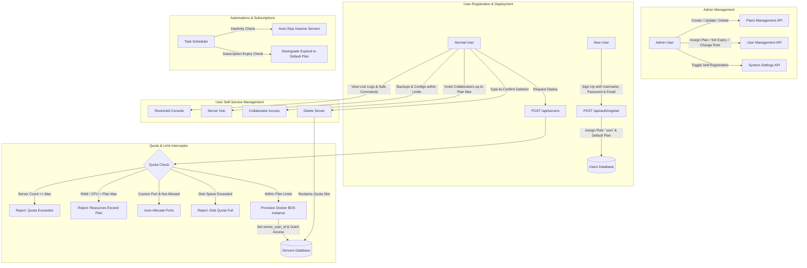

# Technical Design & Implementation Plan: User Plans, Limits & Server Deployment

This document specifies the complete architecture and implementation blueprint for introducing **User Plans & Resource Limits** to Bedrock Server Manager. It enables normal users (`user` role) to self-deploy and manage Minecraft Bedrock servers within admin-defined quotas, while administrators can create, configure, and manage multiple customizable plans.

---

## 1. High-Level Architecture Overview



---

## 2. Core Decisions & Specifications

1. **User Role Hierarchy**:
   - `admin`: Unrestricted full system access.
   - `operator`: Existing role for managing specific assigned servers.
   - `user`: Normal user/customer role governed by Plan limits with self-service server deployment.

2. **Plan Assignment, Expiration & Subscription-Ready Design**:
   - Configurable **Default Plan** assigned to new signups.
   - User table tracks `plan_id`, `plan_status` (`active`, `trial`, `expired`), and optional `plan_expires_at` timestamp.
   - Background check downgrades expired time-limited plans to the system Default Plan non-destructively.

3. **Configurable Plan Limits**:
   - **Compute**: Max active/total servers, Max RAM per server (e.g. 2GB, 4GB), Max CPU cores per server.
   - **Storage & Backups**: Max backups per server, Max disk storage or world size (`max_disk_mb`).
   - **Game Configuration**: Max player slots (`max-players`), Custom seed allowed (yes/no), Preview builds allowed (`allow_preview_versions`).
   - **Network**: Auto-allocated ports only vs. Custom port selection permitted.
   - **Collaboration**: Max allowed co-operators/collaborators (`max_collaborators`: 0 = owner only, 1-3 = team sharing).
   - **Inactivity Lifecycle**: Optional idle auto-stop timeout in minutes (`idle_timeout_minutes`: 0 = 24/7, >0 = stop after N minutes of 0 players).
   - **Feature Toggles**: Permissions for Addons, Port Gate access keys, and Scheduled tasks.

4. **Server Ownership & Deletion Safeguard**:
   - Servers record `owner_user_id`.
   - Normal users can start, stop, restart, configure (within limits), create backups (up to limit), invite collaborators (up to limit), and **delete** their own servers.
   - **Type-to-Confirm**: Users must type the exact server name to confirm deletion, immediately freeing up their server quota slot.

5. **Server Hub & Console Behavior for Normal Users**:
   - Normal users get full UI controls (properties editor, player list/bans/kicks, backups within limit).
   - **Restricted Console**: Normal users have real-time live log viewing and safe command execution (`say`, `time`, `weather`, `kick`, `list`, `whitelist`, etc.), while blocking dangerous system or host commands.
   - UI tabs are dynamically hidden if disabled in the user's plan (e.g., Addons, Port Gate Keys, Tasks).

6. **Plan Deletion Safeguard**:
   - Deleting a Plan is strictly blocked if any active users are currently assigned to it, returning an error listing the count of affected users so the Admin can reassign them first.

7. **Limit Enforcement Policy**:
   - **Non-destructive**: If an admin downgrades a plan or user, existing running servers are preserved. Creating new servers, generating extra backups, or increasing resource specs above the new limits is blocked.

8. **Self-Registration**:
   - Admin-configurable setting (`allow_registration: true/false`).
   - Registration flow collects `username`, `password`, and optional `email` for password recovery and identity verification.
   - Rate-limited and activated immediately with the Default Plan.

---

## 3. Database Schema Changes

### 3.1 New Table: `plans`
```sql
CREATE TABLE IF NOT EXISTS plans (
    id INTEGER PRIMARY KEY AUTOINCREMENT,
    name TEXT UNIQUE NOT NULL,
    description TEXT NOT NULL DEFAULT '',
    is_default INTEGER NOT NULL DEFAULT 0,
    billing_interval TEXT NOT NULL DEFAULT 'permanent', -- permanent, monthly, trial
    trial_duration_days INTEGER NOT NULL DEFAULT 0,
    max_servers INTEGER NOT NULL DEFAULT 1,
    max_memory TEXT NOT NULL DEFAULT '2G',
    max_cpu REAL NOT NULL DEFAULT 2.0,
    max_backups_per_server INTEGER NOT NULL DEFAULT 3,
    max_disk_mb INTEGER NOT NULL DEFAULT 0, -- 0 = unlimited
    max_player_slots INTEGER NOT NULL DEFAULT 10,
    max_collaborators INTEGER NOT NULL DEFAULT 0, -- 0 = owner only
    idle_timeout_minutes INTEGER NOT NULL DEFAULT 0, -- 0 = 24/7 runtime
    allow_custom_seed INTEGER NOT NULL DEFAULT 1,
    allow_custom_port INTEGER NOT NULL DEFAULT 0,
    allow_preview_versions INTEGER NOT NULL DEFAULT 0,
    allow_addons INTEGER NOT NULL DEFAULT 1,
    allow_port_gate_keys INTEGER NOT NULL DEFAULT 1,
    allow_tasks INTEGER NOT NULL DEFAULT 0,
    created_at TEXT NOT NULL,
    updated_at TEXT NOT NULL
);
CREATE INDEX IF NOT EXISTS idx_plans_default ON plans(is_default);
```

### 3.2 Additions to `users` Table
```sql
ALTER TABLE users ADD COLUMN email TEXT NOT NULL DEFAULT '';
ALTER TABLE users ADD COLUMN plan_id INTEGER REFERENCES plans(id) ON DELETE SET NULL;
ALTER TABLE users ADD COLUMN plan_status TEXT NOT NULL DEFAULT 'active';
ALTER TABLE users ADD COLUMN plan_expires_at TEXT NULL;
CREATE INDEX IF NOT EXISTS idx_users_plan ON users(plan_id);
```

### 3.3 Additions to `servers` Table
```sql
ALTER TABLE servers ADD COLUMN owner_user_id INTEGER REFERENCES users(id) ON DELETE SET NULL;
CREATE INDEX IF NOT EXISTS idx_servers_owner ON servers(owner_user_id);
```

### 3.4 Seed Default Plan Migration
When migrating, if no plans exist:
- Create a `"Default Plan"` with:
  - `is_default: 1`, `billing_interval: 'permanent'`
  - `max_servers: 1`, `max_memory: '2G'`, `max_cpu: 2.0`, `max_backups_per_server: 3`
  - `max_disk_mb: 5120` (5GB), `max_player_slots: 10`, `max_collaborators: 0`
  - `idle_timeout_minutes: 0` (24/7 runtime)
  - `allow_custom_port: 0`, `allow_custom_seed: 1`, `allow_preview_versions: 0`
  - `allow_addons: 1`, `allow_port_gate_keys: 1`, `allow_tasks: 0`

---

## 4. API Endpoints & Contract Changes

### 4.1 Plan Management API (Admin Only)
- `GET /api/plans`: List all plans (includes assigned user count per plan).
- `POST /api/plans`: Create a new plan.
- `GET /api/plans/{id}`: Get plan details.
- `PUT /api/plans/{id}`: Update plan limits.
- `DELETE /api/plans/{id}`: Delete a plan (blocks if assigned user count > 0 or if default).
- `POST /api/plans/{id}/set-default`: Set as system default plan.

### 4.2 User Plan, Profile & Registration API
- `GET /api/user/plan`: Returns the logged-in user's assigned plan, usage stats, and limits.
- `POST /api/auth/register`: Public registration endpoint accepting `username`, `password`, optional `email` (governed by `allow_registration` setting).
- `PUT /api/users/{id}/plan`: (Admin) Reassign a user's plan and set optional `plan_expires_at`.

### 4.3 Server Deployment & Operation Updates
- `POST /api/servers`:
  - Accessible by `admin` and `user`.
  - For `user`:
    - Validates server count < `plan.max_servers`.
    - Validates requested RAM <= `plan.max_memory`.
    - Validates requested CPU <= `plan.max_cpu`.
    - Validates version selection (`allow_preview_versions`).
    - If `!plan.allow_custom_port`, forces auto-allocated port pair via `allocator.FindAvailablePortPair`.
    - If `!plan.allow_custom_seed` and seed provided, rejects or strips seed.
    - Sets `owner_user_id = user.ID`.
    - Automatically adds an entry in `user_server_access`.
- `DELETE /api/servers/{id}`:
  - Accessible by `admin` and the server's `owner_user_id`.
  - Requires type-to-confirm in UI.
  - Cleans up server container and files, freeing quota.
- `POST /api/servers/{id}/collaborators`:
  - Accessible by server owner (if `plan.max_collaborators > 0`) or `admin`.
  - Adds/removes collaborators in `user_server_access` up to `plan.max_collaborators`.
- `POST /api/servers/{id}/command`:
  - For `user` role: Sanitizes and checks command against allowed safe command list (`say`, `time`, `weather`, `kick`, `list`, `whitelist`, etc.).
- `POST /api/servers/{id}/backups`:
  - Checks backup count < `plan.max_backups_per_server` and disk storage < `plan.max_disk_mb`.

---

## 5. Web UI & Frontend Experience

1. **Admin Navigation & Plan Management**:
   - New sidebar item: **"Plans"** (visible to Admins).
   - Data table with plan name, max servers, RAM/CPU caps, default badge, assigned user count, and action menu.
   - Interactive modal to Create / Edit plans with sliders/inputs for limits and feature toggle switches.

2. **User Management Enhancement (`Users.tsx`)**:
   - Add "Plan" column showing assigned plan with badge and expiration indicator.
   - In "Add User" and "Edit User" dialogs: Role selection includes `Admin`, `Operator`, and `User`. If `User` is selected, an assigned Plan dropdown and optional expiration date picker are provided.

3. **Normal User Dashboard & Server Deployment**:
   - **Plan Status Banner / Card**: Displays Plan Name, Server Quota progress bar (`1 / 2 Servers`), RAM limit, and Backup limit.
   - **Server Creation Modal**:
     - Pre-fills/restricts RAM & CPU options to the user's plan maximums.
     - Port selection is auto-assigned unless `allow_custom_port` is true.
     - Disables "+ New Server" button when server quota is reached with an informative banner.

4. **Server Hub for Normal Users**:
   - Console tab shows live logs; command bar restricts commands to safe gameplay commands.
   - Collaborators management tab/modal enabled if `plan.max_collaborators > 0`.
   - Tabs like Addons or Port Gate Keys are conditionally rendered according to plan toggles.
   - Settings tab includes type-to-confirm server deletion dialog.

5. **Self-Registration Flow**:
   - Admin settings toggle: "Enable Public Registration".
   - Login page displays "Don't have an account? Sign Up" if registration is enabled.
   - Register page (`/register`) accepts username, password, and optional email, creates account, assigns default plan, and redirects to dashboard.

---

## 6. Verification & Test Plan

1. **Unit & Database Tests**:
   - Test Plan CRUD operations, default plan constraints, and migration logic.
   - Test deletion rejection when users are assigned to a plan.
   - Test subscription expiration downgrade task.
2. **API Quota Enforcement Tests**:
   - Test server creation blocked when user quota is exceeded.
   - Test server creation rejected if memory or CPU exceeds plan limit.
   - Test port auto-allocation enforced when `allow_custom_port` is false.
   - Test safe command filtering for `user` role.
   - Test collaborator invite limits (`max_collaborators`).
   - Test user server deletion reclaiming quota slot.
   - Test backup creation blocked when backup limit or disk quota is reached.
3. **End-to-End Flow**:
   - Admin enables public registration and creates custom plan "Pro Tier".
   - New user signs up, verifies default plan assigned.
   - User deploys server 1; attempts to deploy server 2 and is blocked by quota.
   - User runs safe commands in console; attempts dangerous command and is blocked.
   - Admin upgrades user to "Pro Tier"; user successfully deploys server 2.
   - User invites a collaborator up to plan limit.
   - User deletes server 1 using type-to-confirm, verifying quota is reclaimed.
